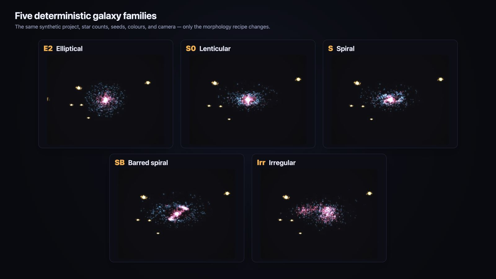
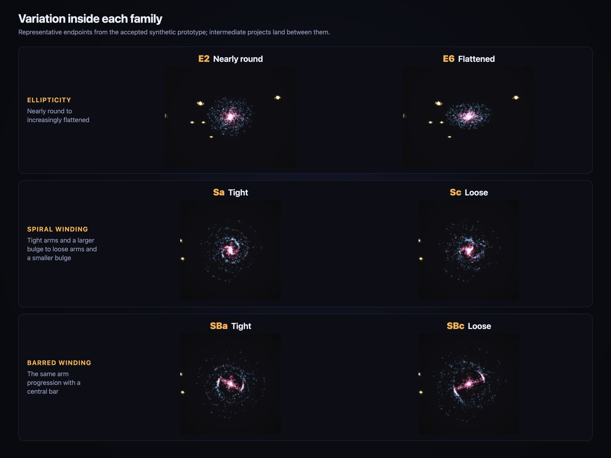

# RubyLens

Your Ruby codebase, as a galaxy.

[](docs/images/galaxy-morphology-families.jpg)

RubyLens reads a Ruby project and writes one self-contained HTML file: classes and modules as magenta stars, tests as a cyan halo, gems as orbiting gold clouds. The galaxy's shape is derived from the code: spiral, elliptical, barred, lenticular, or irregular.

```ruby
# Gemfile
gem "rubylens", require: false
```

```sh
bundle exec rubylens report
```

Open `rubylens-report.html` in your browser. No server needed.

Three commands, three levels of disclosure:

| For | Command | Reveals |
| --- | --- | --- |
| Yourself | `rubylens report` | The interactive Explorer: real class, module, and gem names, search, flight |
| Your team, your talk | `rubylens clip --details` | A 60-second seamless MP4 loop with stats and drifting labels |
| Anyone | `rubylens clip` | Project name and galaxy shape, nothing else |

> [!IMPORTANT]
> Nothing is uploaded and no source code is embedded. Outputs still name your project and can name classes and gems. See [Privacy and sharing](#privacy-and-sharing).

https://github.com/user-attachments/assets/43570623-6d98-46c9-9303-7faa4035b2a7

*The Explorer on Rails: search, fly to a class, expand a gem cloud.*

https://github.com/user-attachments/assets/bb266de5-bbd7-4ccd-814b-15961b45bd39

*A `--details` clip: what your team sees.*

## Setup notes

RubyLens runs from inside an existing Ruby project's bundle, and the project must be inside a Git repository. Run it from each project's own bundle.

`clip` writes `rubylens-clip.mp4` plus the `rubylens-showcase.html` it records, and needs Chrome (or Chromium) and ffmpeg installed; it renders locally and names whatever is missing. Swap in `rubylens showcase [--details]` for the self-playing HTML page alone.

RubyLens uses the current directory when you omit `TARGET`. To visualize a subdirectory while using the current project's bundle and root lockfile, run:

```sh
bundle exec rubylens report components/payments --lockfile Gemfile.lock
```

For complete gem clouds, generate from a project with a readable `Gemfile.lock` after `bundle install`. Without a lockfile, RubyLens still shows Core and Tests but omits Gems and reports a warning. It never fetches missing dependencies during generation.

## Privacy and sharing

RubyLens indexes and renders locally. Generated HTML files contain their scripts, styles, fonts, and data, make no network requests, and open without Node or an HTTP server. Clip rendering also stays local: it drives your own Chrome and ffmpeg over loopback and never uploads anything.

But the outputs still describe your project:

- Explorer embeds fully qualified class, module, and gem names. It omits source text, comments, paths, and names for individual dependency stars.
- Minimal Showcase omits code and gem names, but still reveals the project name plus the galaxy's shape and scale.
- Details Showcase adds aggregate statistics and selected code/dependency names.
- Clip shows on screen exactly what the recorded Showcase shows, in a format anyone can replay.

Galaxy shape is also information: a package's rendered shape can make the rough makeup of that gem easier to see, even though it reveals no source text.

Default outputs are written atomically with owner-only `0600` permissions. RubyLens also adds the exact default output and its temporary-file pattern to the repository's local `.git/info/exclude`, so it does not change the shared `.gitignore`.

RubyLens updates its own existing default output, but refuses to overwrite a tracked file or an unrelated file at that path.

Custom output paths are written exactly where requested, may replace an existing file there, and are not added to Git's local excludes. Choose the path carefully and review the HTML before sharing it.

## Using Explorer

Explorer lets you search and move through Core code, Tests, and Gems while the galaxy continues to drift.

- Drag to orbit.
- Scroll at the cursor to zoom.
- Shift-drag, use Pan mode, or use the arrow keys to move across the galaxy.
- Search for classes, modules, and gems from the side panel.
- Select a class, module, or dependency system to fly to a top-down comparison that keeps Core visible for scale.
- Double-click a gem cloud to expand its existing stars.
- Press Space or use the toolbar to pause/resume drift.
- Use Reset to restore the default camera without changing your drift choice.

Explorer requires WebGL2 to render the complete galaxy. If WebGL2 is unavailable or its context is lost, RubyLens stops the artwork and shows an explicit warning instead of silently presenting a sampled or incomplete galaxy.

## Using Showcase

Showcase is autonomous and noninteractive. It opens directly, rotates once per minute, and contains no Explorer controls, search, hover, or navigation.

Use the default Minimal mode when the visual shape is enough:

```sh
bundle exec rubylens showcase
```

Use `--details` when you want aggregate statistics and one-at-a-time cinematic labels:

```sh
bundle exec rubylens showcase --details
```

Showcase also requires WebGL2. A browser with `prefers-reduced-motion` enabled receives one stable frame with no cinematic labels.

## Using Clip

Clip records the Showcase into `rubylens-clip.mp4`: one full camera rotation at 1920×1080 and 30 frames per second, encoded as H.264 for compatibility with Slack, X, LinkedIn, and slide decks. The video ends exactly where it began, so it loops seamlessly on replay.

```sh
bundle exec rubylens clip
bundle exec rubylens clip --details
```

Clip needs two locally installed tools and checks for them before doing any work:

- **Chrome or Chromium** for headless WebGL2 rendering. Discovery checks `PATH` and common install locations; set `RUBYLENS_CHROME` to point at a specific binary.
- **ffmpeg** for H.264 encoding (`brew install ffmpeg` or `apt install ffmpeg`); set `RUBYLENS_FFMPEG` to override discovery.

Frames render deterministically off-screen, so nothing flashes across your display, and progress is reported as the 1,800 frames encode. Expect a few minutes on machines without GPU acceleration. The showcase HTML is always written next to the video, so a failed render still leaves you a shareable page.

## What the stars mean

- **Core** is magenta. Its stars represent classes and modules from the project's main Ruby code.
- **Tests** are cyan. They represent test classes and modules. RubyLens also adds class-like stars for RSpec `describe` and `context` calls under `spec/` or `specs/`.
- **Gems** are warm gold. Each gem forms a cloud of anonymous stars. Related gems from the same materialized Git source can appear together as one dependency system.

RubyLens uses Rubydex to find classes, modules, methods, constants, inheritance, reopenings, and references. It does not claim that references form a complete call graph, and it never executes the project or its tests.

RubyLens analyzes tracked `.rb`, `.rake`, `.rbs`, and `.ru` files inside the target, plus untracked files of those types that Git does not ignore. It reads dependency versions from `Gemfile.lock` and analyzes gem code already installed locally.

RubyLens is not a type checker, whole-program call graph, source browser, route explorer, or per-dependency-star inspector.

## Galaxy morphology

RubyLens uses the [Hubble sequence](https://science.nasa.gov/asset/hubble/the-hubble-tuning-fork-classification-of-galaxies/) as a visual vocabulary. It uses broad code counts to choose a repeatable shape for the central Core/Test galaxy and each dependency package independently. A package never inherits the project's, host's, or dependency system's decision.

The morphology describes the rendered shape. It is not a claim about the project's architecture, purpose, quality, or correctness.

[](docs/images/galaxy-morphology-variations.jpg)

*Representative endpoints inside the elliptical, spiral, and barred-spiral families.*

Read the [accepted morphology design](docs/specs/2026-07-14-galaxy-morphology-design.md) or [stellar design research](docs/STELLAR_DESIGN_RESEARCH.md) for the full visual model.

## CLI reference

```text
rubylens report [OPTIONS] [TARGET]
rubylens clip [OPTIONS] [TARGET]
rubylens showcase [OPTIONS] [TARGET]
```

All commands accept:

- `-o FILE` / `--output FILE` to choose an output path
- `--lockfile FILE` to use a specific `Gemfile.lock`
- `-h` / `--help` to show command help

`rubylens clip` and `rubylens showcase` also accept `--details`. A custom `rubylens clip --output movie.mp4` writes the recorded showcase to `movie.html` next to it.

## Ruby API

```ruby
require "rubylens"

report = RubyLens.generate_report(path: ".")
puts report.output_path
puts report.counts
puts report.warnings

showcase = RubyLens.generate_showcase(path: ".", details: true)
puts showcase.output_path

clip = RubyLens.generate_clip(path: ".", progress: ->(done, total) { puts "#{done}/#{total}" })
puts clip.output_path    # the MP4
puts clip.showcase_path  # the showcase HTML it recorded
```

Passing `output:` selects a custom path. The caller is responsible for keeping custom outputs private.

## Development

RubyLens supports Ruby 3.2 through 4.0. The repository's `.ruby-version` and `.node-version` select the development runtimes. Activate Ruby with your version manager, then install the Ruby and JavaScript dependencies:

```sh
bundle install
npm ci
```

Run the Ruby and JavaScript unit tests:

```sh
bundle exec rake test
npm run test:unit
```

Run the browser tests:

```sh
npx playwright install chromium
npm run test:browser
```

Build the gem:

```sh
gem build rubylens.gemspec
```

The product and design contracts live in [PRODUCT.md](PRODUCT.md) and [DESIGN.md](DESIGN.md). Scale and benchmark notes live in [docs/PERFORMANCE.md](docs/PERFORMANCE.md).

## License

RubyLens is available under the [MIT License](LICENSE.txt).
