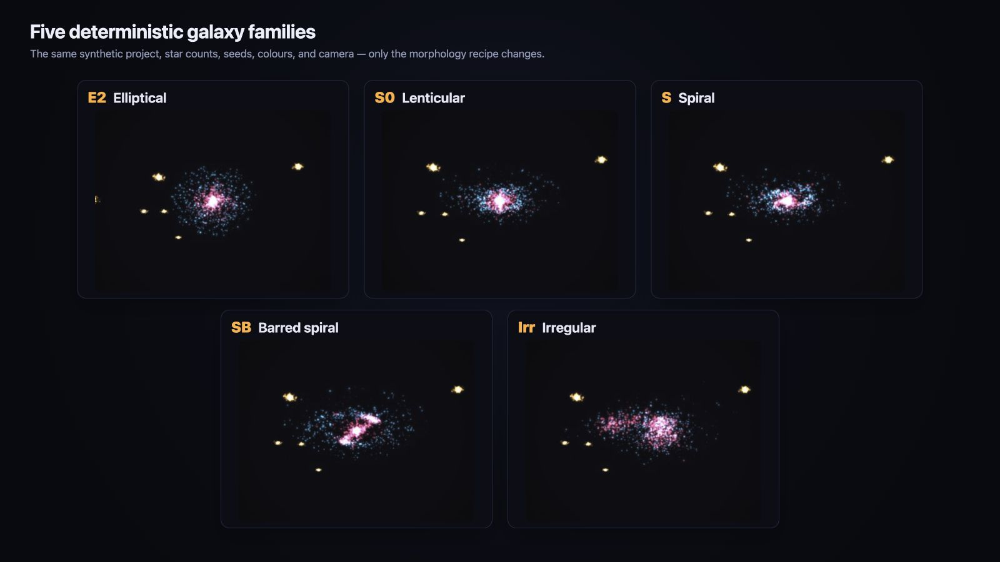

# RubyLens

Your Ruby codebase, as a galaxy.

RubyLens turns a Ruby project into a 3D galaxy. Classes and modules are magenta,
tests are cyan, and indexed dependencies appear in gold. The shape comes from
the codebase itself.

[Explore RuboCop, Rails, Discourse, and rubygems.org as Ruby galaxies](https://st0012.dev/ruby-galaxies/).

## Try it

From a Ruby 3.2 through 4.0 project inside a Git repository, add RubyLens to the
`Gemfile`:

```ruby
gem "rubylens", require: false
```

Then install the bundle and generate the interactive Explorer:

```sh
bundle install
bundle exec rubylens report
```

Open `rubylens-report.html` directly in your browser with
`open rubylens-report.html` on macOS or `xdg-open rubylens-report.html` on Linux.

## Pick an output

| What you want | Command | Output |
| --- | --- | --- |
| Search and explore your code | `bundle exec rubylens report` | Interactive HTML with class, module, and gem names |
| Share a self-playing page | `bundle exec rubylens showcase` | Minimal HTML without class, module, or gem names |
| Include selected names and statistics | `bundle exec rubylens showcase --details` | Detailed self-playing HTML |
| Post or present a video | `bundle exec rubylens clip [--details]` | MP4 plus the matching Showcase HTML |

Clip requires Chrome or Chromium with WebGL2 and ffmpeg. Showcase rotates once
per minute unless the browser requests reduced motion. Clip records that full
one-minute rotation.

## See it

https://github.com/user-attachments/assets/ec8d9357-c726-463b-bbde-0fd6eca25d2c

*The Explorer on Discourse: search, fly to a class, and expand a gem cloud.*

https://github.com/user-attachments/assets/972a15b9-d863-4a52-85e1-af7bc92c0459

*A detailed Clip generated from the same codebase.*

[Open Ruby Galaxies](https://st0012.dev/ruby-galaxies/) to watch RuboCop, Rails,
Discourse, and rubygems.org and launch their interactive Explorers.

## What the stars mean

- **Core** is magenta. Its stars represent classes and modules from the project's main Ruby code.
- **Tests** are cyan. They represent test classes and modules, plus class-like stars for RSpec `describe` and `context` calls.
- **Gems** are gold. Each indexed dependency gets a marker, and its indexed declarations form the surrounding cloud. Individual dependency stars have no labels.

RubyLens uses Shopify's [Rubydex](https://shopify.github.io/rubydex/) to map
classes, modules, methods, constants, inheritance, and references. It does not
execute your project or tests. Travel flights are a visual sample of resolved
references, not a call graph.

## Privacy and sharing

Everything runs locally. Generated HTML files inline the scripts, styles, and
data they need, make no network requests, and include no source text, comments,
or local paths from your project. Inside the target project, RubyLens indexes
Git-tracked Ruby files plus untracked Ruby files that are not ignored by Git.
RubyLens does not read Rubydex's
[`rubydex.toml` configuration](https://shopify.github.io/rubydex/Rubydex/Config.html).
The `TARGET` argument and Git determine which project files RubyLens indexes.

Outputs still reveal project structure. Explorer includes class, module, and gem
names. Minimal Showcase and its matching Clip omit those names but still reveal
the project name, shape, scale, and a small anonymous sample of relationships.
`--details` on Showcase or Clip adds statistics and selected names. Review any
output before sharing it.

Default outputs use owner-only permissions and are added to the repository's
local Git excludes. Custom output paths are not automatically excluded and
overwrite any existing file at that path.

## Using Explorer

- Drag to orbit and scroll at the cursor to zoom.
- Shift-drag, use Pan mode, or use the arrow keys to move.
- Search for classes, modules, and gems from the side panel.
- Select an item to fly to a top-down comparison that keeps Core visible for scale.
- Double-click a gem cloud to expand it.
- Press Space to pause or resume drift, and use Reset to restore the default camera.

Explorer and Showcase require WebGL2 so they can render the complete galaxy.

## CLI reference

```text
rubylens report [OPTIONS] [TARGET]
rubylens showcase [OPTIONS] [TARGET]
rubylens clip [OPTIONS] [TARGET]
```

All commands accept `-o FILE` / `--output FILE`, `--lockfile FILE`, and
`-h` / `--help`. Showcase and Clip also accept `--details`.

## Q & A

### Why don't I see some or all dependency clouds?

RubyLens builds dependency clouds from `Gemfile.lock` and gem code installed in
the current bundle. Run `bundle install`, then rerun the same RubyLens command.

Without a readable lockfile, RubyLens omits all dependency clouds. With an
incomplete bundle, only the dependencies RubyLens can find appear. RubyLens
warns in both cases and never fetches missing dependencies. Expand the warning
summary in Explorer for the available details.

If the target is a subdirectory but `Gemfile.lock` is at the repository root,
pass it explicitly:
`bundle exec rubylens report components/payments --lockfile Gemfile.lock`.

### What types of galaxies can it generate?

[](docs/images/galaxy-morphology-families.jpg)

RubyLens generates five galaxy families: elliptical, lenticular, spiral,
barred spiral, and irregular. It uses the
[Hubble sequence](https://science.nasa.gov/asset/hubble/the-hubble-tuning-fork-classification-of-galaxies/)
as its visual vocabulary and gives the project and its dependency clouds
repeatable shapes based on the indexed codebase.

A shape is an artistic interpretation, not a claim about the project's
architecture, quality, or correctness.

## Development

The repository pins its development runtimes in `.ruby-version` and
`.node-version`. Activate those versions, then run both unit-test suites:

```sh
bundle install
npm ci
bundle exec rake test
npm run test:unit
```

Browser tests use `npm run test:browser` after `npx playwright install chromium`.
The [product](PRODUCT.md), [design](DESIGN.md), and
[performance](docs/PERFORMANCE.md) documents describe the deeper contracts.

## License

RubyLens is available under the [MIT License](LICENSE.txt).
